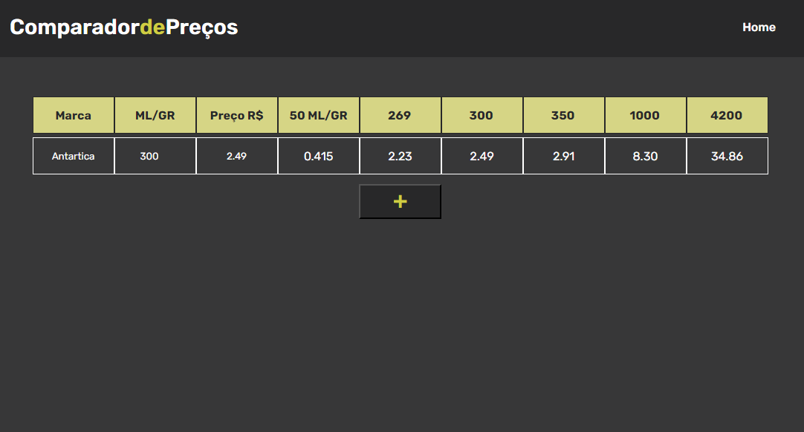

# Comparador de Preços

> Este projeto tem o objetivo de oferecer uma calculadora para comparar os preços de produtos com quantidades e preços diferentes.

## 💻 Técnologias e ferramentas

As seguintes tecnologias/ferramentas foram utilizadas para desenvolver o Comparador de Preços:

   

## ☕ Usando o Comparador de Preços

Acesse o projeto em execução no Github Pages, através do link: [Comparador de Preços](https://gabrielsouzas.github.io/price-calculator/)

## 🤝 Colaboradores

Agradecemos às seguintes pessoas que contribuíram para este projeto:

<table>
  <tr>
    <td align="center">
      <a href="#">
         
        
          <b>Gabriel Souza</b>
        
      </a>
    </td>
  </tr>
</table>

[⬆ Voltar ao topo](#price-calculator) 
